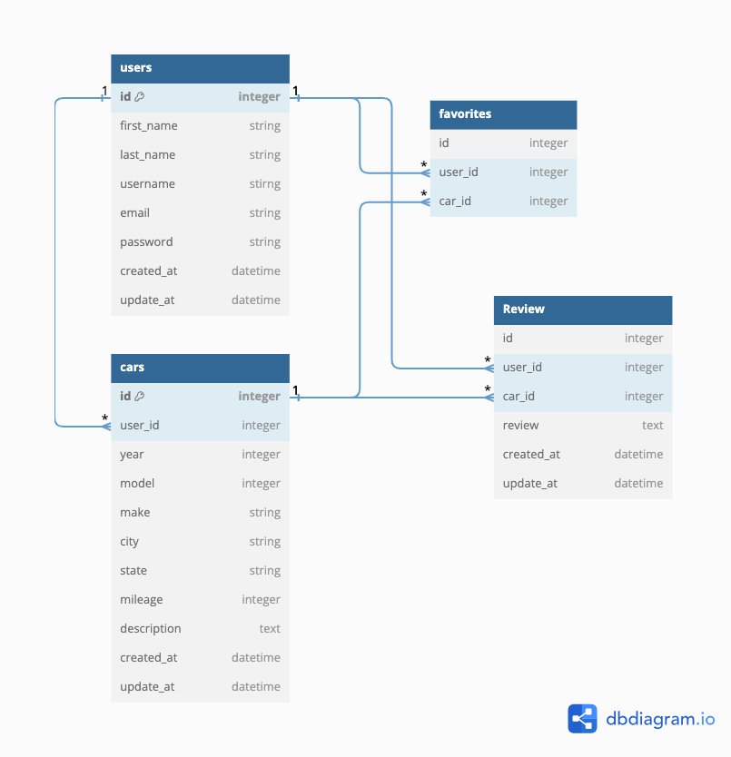

# **Database Schema**

## `users`

| column name | data type | details                   |
|-------------|-----------|---------------------------|
| id          | integer   | not null, primary key     |
| first_name  | string    | not null                  |
| last_name   | string    | not null                  |
| username    | string    | not null, unique          |
| email       | string    | not null, unique          |
| password    | string    | not null                  |
| created-at  | datetime  | not null                  |
| updated-at  | datetime  | not null                  |

## `cars`

| column name | data type | details               |
|-------------|-----------|-----------------------|
| id          | integer   | not null, primary key |
| user_id     | integer   | not null, foreign key |
| year        | integer   | not null              |
| model       | string    | not null              |
| make        | string    | not null              |
| city        | string    | not null              |
| state       | string    | not null              |
| mileage     | integer   | not null              |
| description | text      | not null              |
| created-at  | datetime  | not null              |
| updated-at  | datetime  | not null              |

* `user_id` references `users` table

## `reviews`

| column name | data type | details               |
|-------------|-----------|-----------------------|
| id          | integer   | not null, primary key |
| user_id     | integer   | not null, foreign key |
| car_id      | integer   | not null, foreign key |
| review      | string    | not null              |
| created-at  | datetime  | not null              |
| updated-at  | datetime  | not null              |

* `user_id` references `users` table
* `car_id` references `cars` table

## `favorites`

| column name | data type | details               |
|-------------|-----------|-----------------------|
| id          | integer   | not null, primary key |
| user_id     | integer   | not null, foreign key |
| car_id      | integer   | not null, foreign key |

* `user_id` references `users` table
* `car_id` references `cars` table

